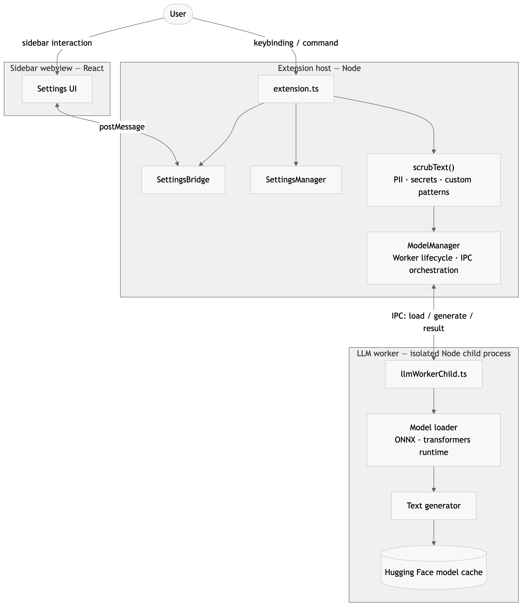
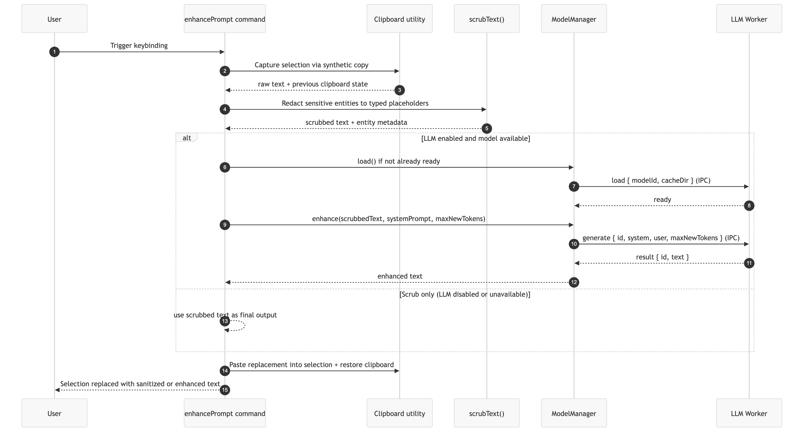

# ContextShield

**Write freely. Scrub sensitive data and improve prompt clarity locally, before you send.**

ContextShield is a VS Code extension for developers who draft prompts quickly and want two guarantees before sending: sensitive values are redacted, and the prompt is clearer and more structured. The entire flow runs locally on your machine using a local ONNX model.

[](https://opensource.org/licenses/MIT)
[](https://code.visualstudio.com/)

---

## Why ContextShield

Developers frequently paste rough notes, stack traces, and config snippets into AI chats. That creates two recurring problems:

- Prompts are noisy, vague, or typo-heavy, which reduces answer quality
- Prompts may contain internal IPs, emails, tokens, or credentials

ContextShield solves both in one workflow:

1. Scrub sensitive data first
2. Optionally enhance wording and structure with a local model
3. Replace the selected text with a safer, clearer version

## What It Is

- A local-first pre-send prompt scrubber and enhancer for VS Code
- Built for Cursor/Copilot-style chat workflows and editor selections
- Best for day-to-day debugging, code review prompts, and incident triage messages

## What It Is Not

- Not a cloud prompt service
- Not a replacement for your AI assistant
- Not a post-send redaction tool — it works before you send text

## Supported Workflows

- AI chat boxes in editor environments (selection + replace flow)
- Code and prose mixed selections
- Scrub-only, enhance-only, or combined mode through settings toggles

## Core Features

- Redacts PII: email, phone, IPv4, UUID
- Redacts secrets: JWT-like strings, AWS-style key IDs, high-entropy tokens, password-in-context patterns
- Supports custom regex patterns for org-specific secrets
- Enhances prompt wording with a local ONNX model (`@huggingface/transformers`)
- Sidebar settings panel for model control, prompt settings, and scrubbing options
- Clipboard-safe replace flow — original clipboard is restored after transformation

## Local-First By Design

- Inference runs locally in an isolated worker process (`dist/llmWorker.js`)
- No cloud inference API in the scrub or enhance pipeline
- Model artifacts are cached under VS Code extension storage (`globalStorageUri/.../hf-cache`)
- Includes a sidebar action to delete local model cache

---

## Screenshot

### Demo


---

## Quick Start

### For users

1. Install the extension
2. Open the ContextShield sidebar (`ContextShield: Open Sidebar`)
3. Download the local model from the **Local model** section
4. Select text in your editor or AI chat input
5. Press `Cmd+Shift+2` (Mac) / `Ctrl+Shift+2` (Windows/Linux)
6. Review the replaced text, then send

### Example transformation

```
Input:
"ths function smetimes returns null idk why i think its the async part
but also the validation might be wrong and also theres an internal ip
10.0.14.22 in there somewhere"

Output:
"Investigate why the function intermittently returns null. Focus on the
async handling and validation logic. The internal IP [IP_ADDRESS] may
also be a contributing factor. Provide a revised implementation that
addresses these issues."
```

---

## Architecture Overview

ContextShield runs as three isolated runtimes: an extension host, a sandboxed React webview, and a separate Node worker process for local inference.

| Runtime | Role | Entry point |
| --- | --- | --- |
| **Extension Host** | Command registration, service wiring, lifecycle, settings, webview bridge | `src/extension.ts` |
| **Sidebar Webview** | React settings UI; sends user intents, receives state snapshots | `src/webview/` |
| **LLM Worker** | Isolated child process for model load and text generation via ONNX | `src/llm/llmWorkerChild.ts` |

### System Architecture



User actions flow from the editor or webview into the extension host, then into the scrubbing engine and optionally into the model manager and isolated worker for enhancement.

---

## Scrub and Enhance Flow

The primary business flow. Scrubbing always runs first; enhancement is conditional on LLM being enabled and the model being ready.



If the model is unavailable or generation fails, the command degrades gracefully to the scrubbed text — it never hard-fails on the enhancement step.

---

## Settings and Model Control

- **Download model** triggers `ModelManager.load()`, which spawns the worker and initializes the ONNX model
- **Delete cache** stops the worker process and removes the local `hf-cache` directory
- **Status updates** are pushed to the webview as `modelStatus` messages: `unknown`, `downloading`, `ready`, or `error`

---

## Why The Architecture Matters

- **Worker isolation** — native model and ONNX runtime failures cannot crash the extension host process
- **Scrub-first pipeline** — sensitive values are always redacted before any text reaches the model
- **Typed protocol** — the shared `webviewProtocol.ts` contract catches integration regressions at compile time
- **Separation of concerns** — webview UI, host message routing, scrubbing engine, and model runtime are fully isolated from each other

---

## Trust And Boundaries

ContextShield is a tool for safer, clearer prompts — not a correctness oracle.

- Scrubbing is pattern-based and can produce false positives or negatives
- Enhancement improves wording and structure; it is not guaranteed to preserve intent perfectly
- You should review transformed output before sending to external AI systems

---

## Installation

### From Marketplace

Install `ContextShield` from the VS Code Marketplace when published.

### From source / VSIX

```bash
npm install
npm run build
```

Then package and install as a VSIX in VS Code.

---

## Model Notes

- Default model: `onnx-community/Llama-3.2-3B-Instruct-ONNX`
- Initial download may take several minutes depending on network and hardware
- Cache persists across extension reloads until manually deleted from the sidebar
- If the model ID changes in settings, a reload is attempted automatically when LLM is enabled

---

## Development

```bash
npm install
npm run check
npm run test
npm run build
```

Press `F5` to launch the Extension Development Host.

### Project Structure

| Path | Role |
| --- | --- |
| `src/extension.ts` | Extension entry point, command registration, lifecycle |
| `src/commands/` | Command implementations |
| `src/scrub/` | PII, secret, and custom pattern scrubbing logic |
| `src/llm/` | ModelManager and isolated worker runtime |
| `src/extensionHost/` | Sidebar provider and host-side message bridge |
| `src/webview/` | React settings panel |
| `src/shared/` | Shared constants, protocol types, and defaults |

---

## License

MIT — see `LICENSE`.